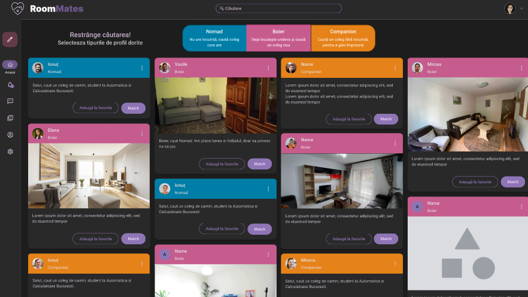
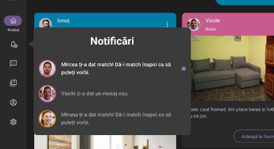
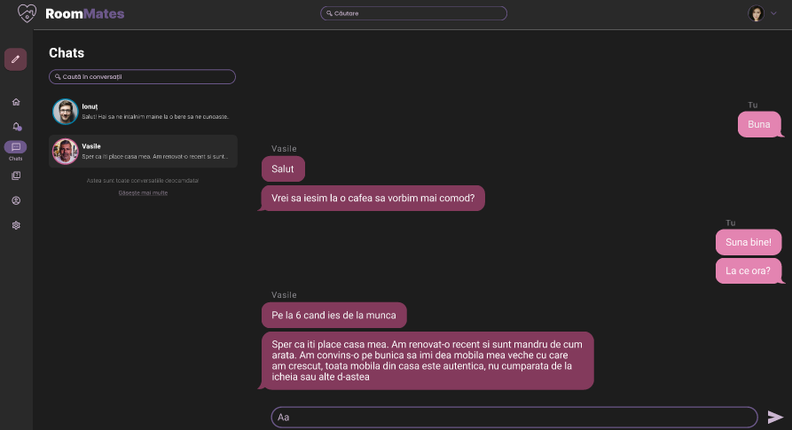
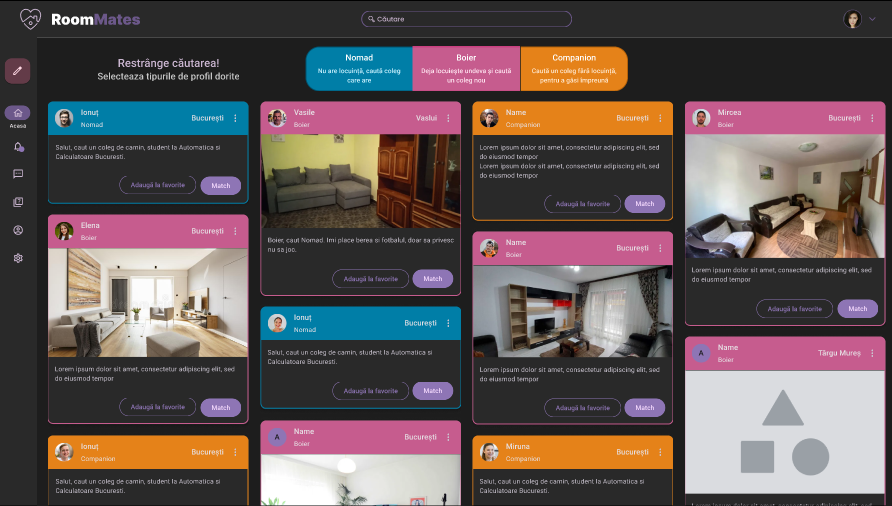
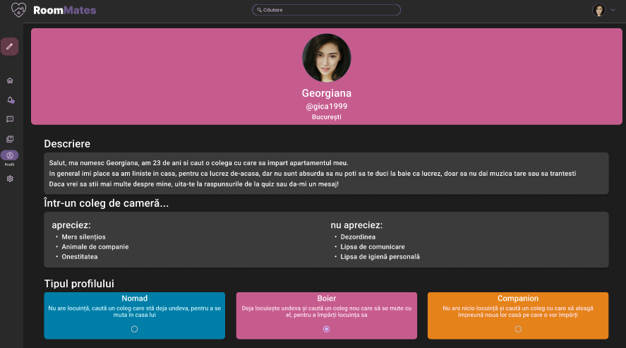
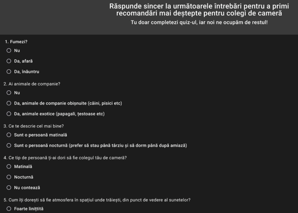

# Face to face interviews
We had one remote interview on Discord, and we turned on our cameras. It's not much, but it's something...

# User persona
The current user personas:
* "Boier" - Deja locuiește undeva și caută un coleg nou
* "Nomad" - Nu are locuință, caută coleg care are
* "Companion" - Caută un coleg fără locuință, pentru a găsi împreună

First (old) iteration personas:
* *"Freshman" - Coming to study in a big / bigger / different city. Has relatively low budget, first criteria usually is low rent. Most relevant criteria for their desired room mates is one of: cleanliness, living place economics, interests such as gaming or drinking, etc*
* *"Respectable" - Has standards, usually done with living in dorms. Wants their own room, so a place to rent, even if looking towards the cheap end. For their desired room mates they usually have two or more criteria: cleanliness, living place economics, respecting others' quiet/sleep time, living place responsibility, already an acquaintance or friend, etc.*
* *"Troubadour" - Has *negotiable* standards, usually looking for mid/low prices for rent. Wants to change living place fairly often, sometimes changing the city, sometimes the people and the place within the city, sometimes just because. Their requests from their future room mates may vary widely.*

# User stories, use cases / user flows
We don't have well defined use cases yet, but we have some, like one for each of the tentative personas defined above.

# Wireframe / mockup
## Mockup first iteration (before validation)
[https://www.figma.com/proto/eRCSlv9RfzqgHg361Zrx0Y/Roommates?node-id=4%3A409&scaling=min-zoom&page-id=0%3A1](https://www.figma.com/proto/eRCSlv9RfzqgHg361Zrx0Y/Roommates?node-id=4%3A409&scaling=min-zoom&page-id=0%3A1)

 

Notifications

 

Chat

 

## Mockup after validation

[https://www.figma.com/proto/a7fogh8EMCCu8iqaitAabk/Roommates-Revised?node-id=4%3A409&scaling=scale-down&page-id=0%3A1&starting-point-node-id=4%3A409](https://www.figma.com/proto/a7fogh8EMCCu8iqaitAabk/Roommates-Revised?node-id=4%3A409&scaling=scale-down&page-id=0%3A1&starting-point-node-id=4%3A409)

Profile

# What we changed
In the mockup we adapted a questionaire for our users, and we decided to not make it mandatory (place less emphasys on it).

