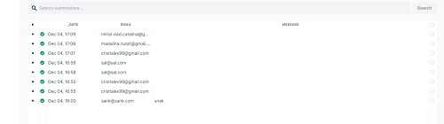
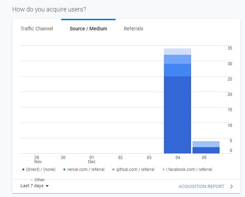
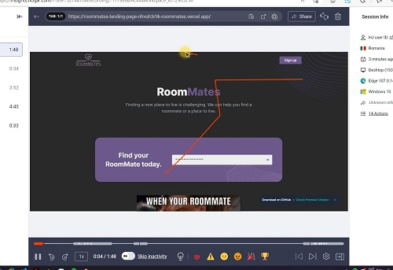
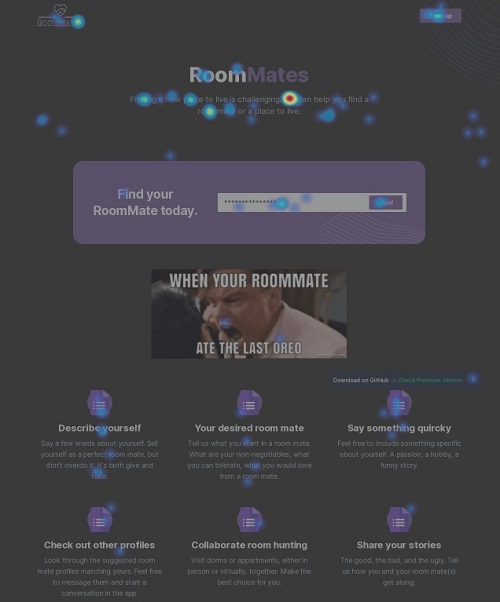
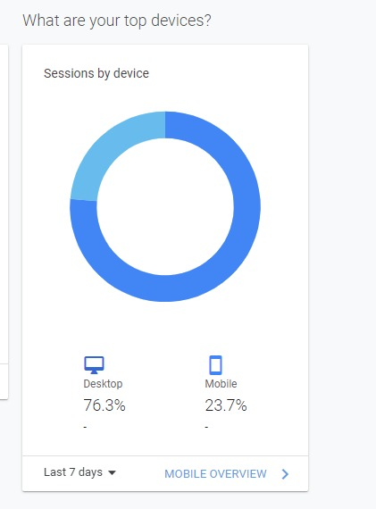

# Lead collection section
We use formspree to collect their emails.

 

We're gonna measure our "funnel"...

It begun, we're waiting, watching...

 

# Analytics and Hotjar
We've got Hotjar hooked up, we're getting recordings!

 
 

Click heat map

 

 

# Who we brought to the landing page
We brought our friends, acquanintaces, and the people we interviewed, and some of their friends.

# Leading campain
We don't think we are there yet with our offering. We have analytics, and we can measure the conversion rate by how many visitors enter an email address.

But following the interviews we had, we might want to rethink/pivot on one of the main features of our solution.
So we believe a leading campain is more opportunistic in a few days, at most a week. We will do it for the next milestone.
