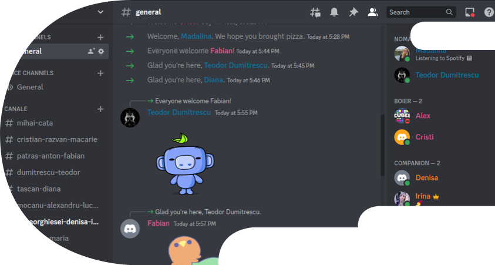
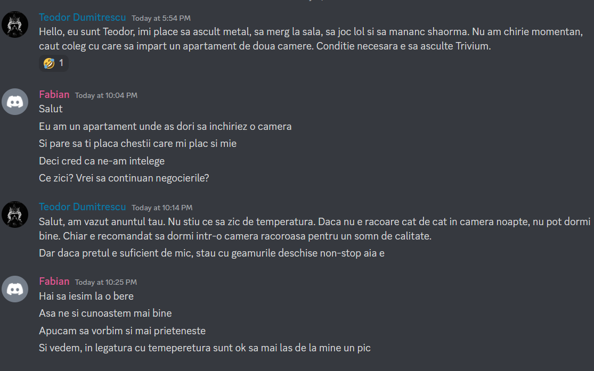
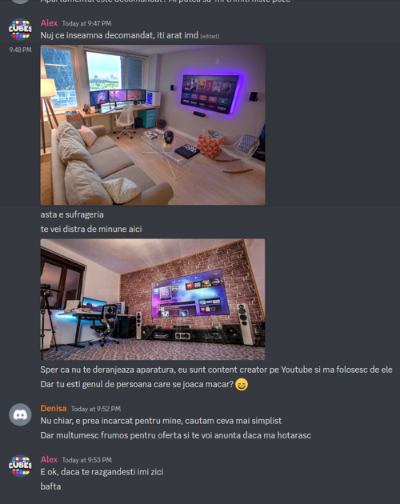

# MVP - on Discord
We created a Discord server where users create their own channel and either post ads for their available rooms or just look at others' ads, and they talk on Discord.

Its limitations: no filter, no search, no matchmaking.

The setup:
* Everyone has the ability to create, edit or delete channels - a sort of wild west on Discord.
* Each user creates a channel with their name, and they describe themselves and possibly what they are after, like a room mate or someone with an available room.

For example, conversations can lead to going out to know each other:

Or sometimes there is no match, but still with civil conversation.

